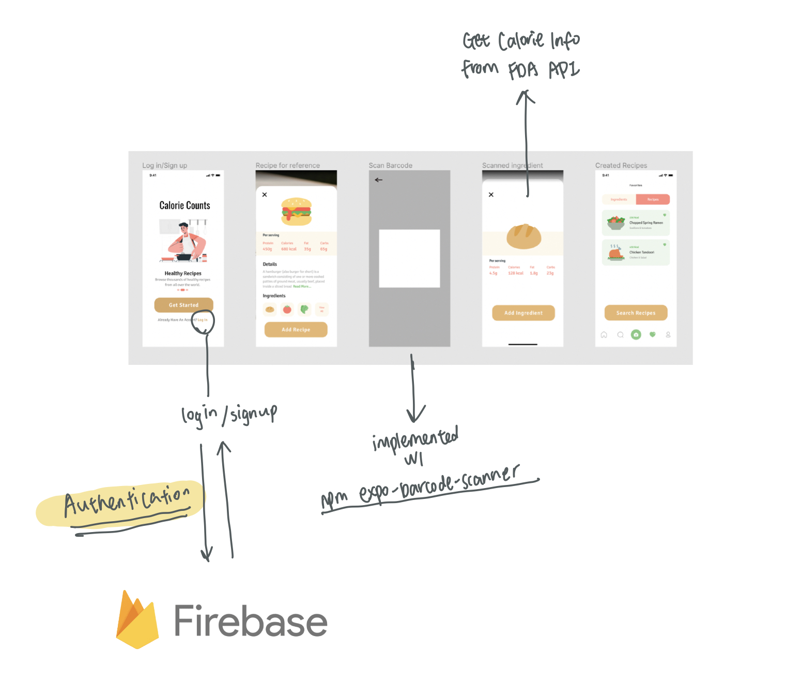

# EC463 MiniProject

Team members: Haocun (Kelly) Wang, Paige Hartley

We use Expo to build our react native app. A calorie tracker for everyday recipes. 

## App Functionalities
### Frontend:  
Barcode Scanner   
Login / Signup   
### Backend:   
Firebase for user authentification  
API Design  
		 
		 
## Components Files Explained
### HomeScreen.js:
User login and signup (if not registered) page. 
### barcodeScanner.js:
Scan barcode to access caloric information of ingredients.
### button.js:
Click the reusable button element to navigate between screens. 
			
